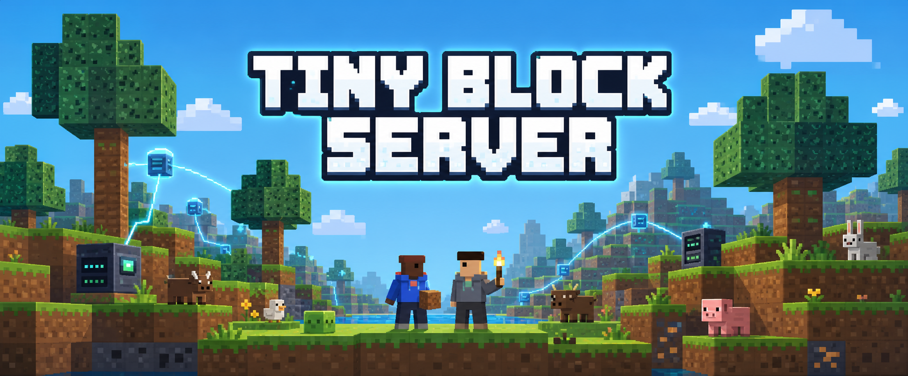
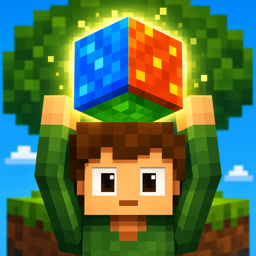

<p align="center">
  
</p>

<p align="center">
  <a href="https://tinyblock.nosuchgames.com/play/">
    
  </a>
</p>

<p align="center">
  Headless dedicated server for <strong>Tiny Block</strong> — a living 2D sandbox game built with Godot 4.
</p>

<p align="center">
  <strong>
    <a href="https://tinyblock.nosuchgames.com/play/">Play on Web</a>
    ·
    <a href="https://apps.apple.com/us/app/tiny-block-one-block-skyblock/id6793160455">Download on the App Store</a>
    ·
    <a href="https://play.google.com/store/apps/details?id=com.nosuchgames.tinyblock">Get it on Google Play</a>
  </strong>
</p>

This repository contains the open-source dedicated server shell. Its world
simulation, multiplayer protocol, persistence, and shared presentation code
come from the pinned
[`tinyblock-gameplay`](https://github.com/hardtab/tinyblock-gameplay) submodule,
which is also used by the official Tiny Block client. Store, advertising,
analytics, and other platform integrations remain outside the shared runtime.

## Quick start

### Prerequisites

- Godot 4.7+ with Linux export templates installed.
- A Tiny Block backend API instance (default: the official public API).

### Build

```bash
git submodule update --init --recursive

# Export the server binary
godot --headless --export-debug "Dedicated Server (Linux/X11)" build/tinyblock-server.x86_64
```

### Run

```bash
./build/tinyblock-server.x86_64 \
  --tinyblock-server \
  --world my_first_world \
  --world-name "My Community Server" \
  --world-mode skyblock \
  --max-players 16
```

The server:
1. Authenticates as a guest installation.
2. Creates or loads the world identified by `--world`.
3. Publishes itself in the official server browser.
4. Accepts players using the official Tiny Block client.

### Arguments

| Argument | Default | Description |
|---|---|---|
| `--tinyblock-server` | — | Required. Enables headless server mode. |
| `--world <id>` | `world_community_1` | Stable world save identifier. Prefix with `world_` automatically if omitted. |
| `--world-name <name>` | `Tiny Block Community` | Public display name in the server browser. |
| `--world-mode <mode>` | `skyblock` | One of: `skyblock`, `floating_islands`, `procedural` (Random World), `one_block`, `challenge_run`. |
| `--max-players <1-16>` | `16` | Capacity advertised by this dedicated server. The backend validates and returns this value to clients. |

## Supported world modes

- **Skyblock** — classic skyblock: start on a small island with limited resources.
- **Floating Islands** — scattered floating islands in the sky.
- **Procedural** (Random World) — infinite procedurally generated terrain.
- **One Block** — a single regenerating block; mine it to progress.
- **Challenge Run** — pre-defined challenge scenarios.

## Multiplayer

The server reuses the official Tiny Block backend for:
- Guest authentication.
- Session creation and listing.
- WebSocket signaling.
- WebRTC data channel relay (with automatic fallback).

Active servers appear automatically in the **Online Worlds** list of the official client at `GET /v1/multiplayer/sessions`.

### Official vs Community

- **Official** — worlds operated by No Such Games (labelled in the client).
- **Community** — every other dedicated server.

Your server does not need pre-approval. It appears when its session is active and disappears after the session TTL expires. The server declares its own capacity with `--max-players`; ordinary player-hosted P2P worlds remain capped at 4.

## Persistence

World saves are stored under the Godot user data directory:

- Linux: `~/.local/share/godot/app_userdata/Tiny Block Server/`

Use `--world <id>` to keep the same world across restarts.

Progression, items, and world state stay on the server. The official Tiny Block servers do not store, back up, or synchronize community world saves.

## Pelican and Pterodactyl

Ready-to-import hosting panel profiles are available in [`pelican-eggs/tiny-block`](./pelican-eggs/tiny-block):

- `egg-tiny-block-server.json` for Pelican Panel.
- `egg-pterodactyl-tiny-block-server.json` for Pterodactyl Panel.

Both profiles download and verify the selected GitHub release, expose the world mode and player limit as panel variables, and keep saves in persistent server storage.

## Project structure

```
tinyblock-server/
├── project.godot             # Godot project file
├── export_presets.cfg        # Linux dedicated server export
├── scenes/
│   └── server_main.tscn      # Server entry scene
├── gameplay/                 # Pinned shared runtime (Git submodule)
│   ├── scripts/              # Simulation, protocol, rendering, persistence
│   └── assets/               # Shared SFX and emoji artwork
├── scripts/
│   ├── server_main.gd        # Headless server entry point
│   └── analytics.gd          # Stub (no analytics)
├── addons/
│   └── webrtc_native/        # Linux-specific WebRTC native plugin
├── tests/                    # Server and multiplayer tests
├── deploy/
│   ├── run-server.sh         # Example launch script
│   └── tinyblock-server.service.example  # Systemd unit example
├── README.md
├── SELF_HOSTING.md
├── CONTRIBUTING.md
├── SECURITY.md
├── THIRD_PARTY_NOTICES.md
└── LICENSE
```

## License

**AGPL-3.0-or-later** — see [LICENSE](./LICENSE).

The Tiny Block name and logos are not granted by the code license. Third-party components retain their original licenses (see [THIRD_PARTY_NOTICES.md](./THIRD_PARTY_NOTICES.md)).
